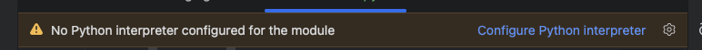
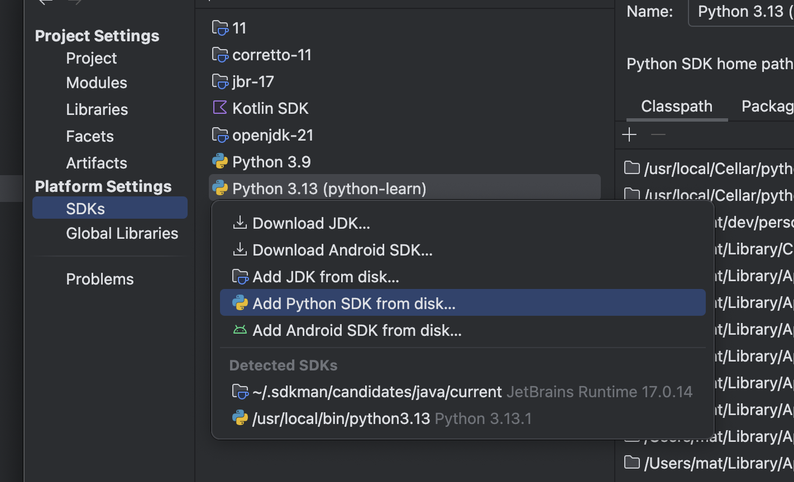
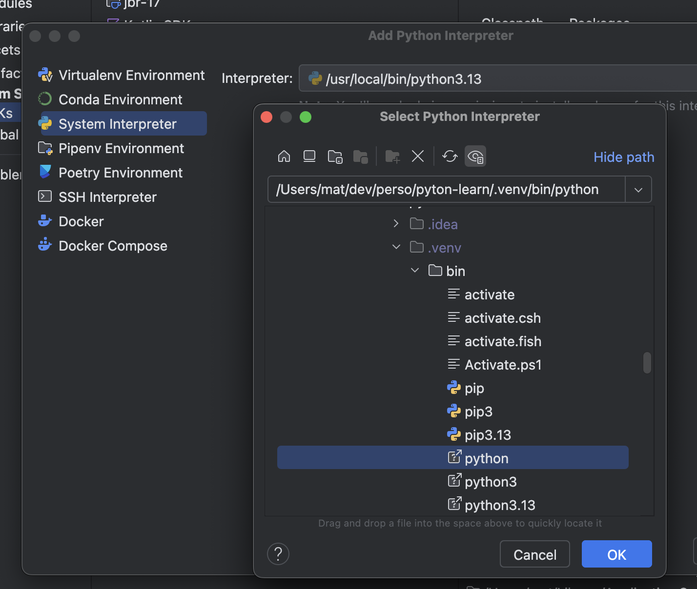
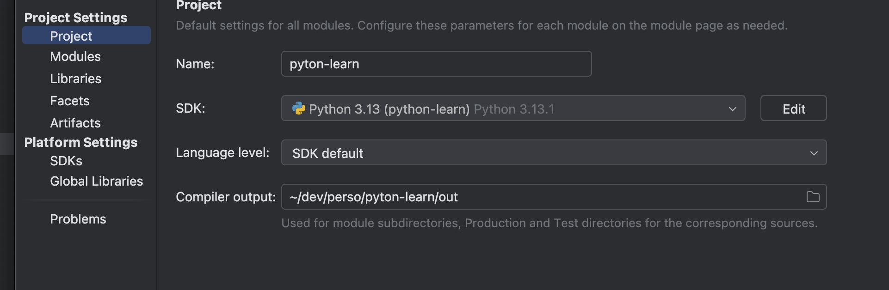

My journey in python 
===

# Installation de l'environnement

Install un environnement local au répertoire pour pas tout niker
```python3 -m venv ./.venv```

Active l'environnement
```. ./.venv/bin/activate```

# Configure intelij

1 - Ouvrir la fenêtre de configuration du projet    

Ou menu file > Project structure

2 - Ajouter un SDK python



3 - Choisir un interpréteur python 


⚠ Ne pas choisir virtual env et bien choisir le binaire python et pas pip :-)

4 - Sélectionner interpreter pour le projet



# Setup

Run the following command : 
```pip install -r requirements.txt```

# To clean up installed modules
```pip freeze | xargs pip uninstall -y```

